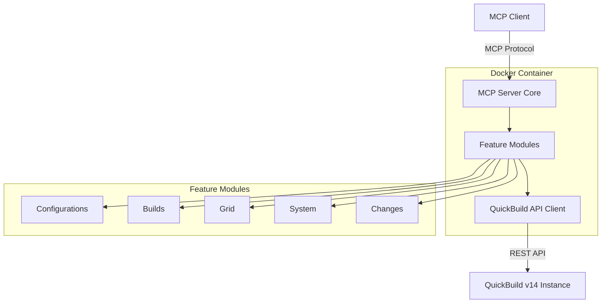

# Design Document

## Overview

The QuickBuild MCP Server is a containerized Python application that serves as a stateless bridge between MCP clients and QuickBuild v14 REST API. The server translates MCP protocol requests into QuickBuild API calls and formats responses back into MCP-compliant structures. The architecture follows a modular "features" pattern for maintainability and extensibility.

## Architecture

### High-Level Architecture



### Component Architecture

The system consists of the following key components:

1. **MCP Server Core** - Entry point and MCP protocol handler
2. **QuickBuild API Client** - Centralized API communication layer
3. **Feature Modules** - Domain-specific functionality groupings
4. **Docker Container** - Isolated deployment environment

## Components and Interfaces

### MCP Server Core (`server.py`)

**Responsibilities:**
- Initialize MCP server using the official Python SDK
- Load and register feature modules
- Handle MCP protocol communication
- Manage server lifecycle

**Key Methods:**
```python
async def main() -> None
async def serve() -> None
def load_features() -> List[Feature]
```

### QuickBuild API Client (`quickbuild_client.py`)

**Responsibilities:**
- Authenticate with QuickBuild REST API
- Manage HTTP sessions and connection pooling
- Handle API request/response formatting
- Implement retry logic and error handling

**Key Methods:**
```python
class QuickBuildClient:
    async def authenticate() -> bool
    async def get(endpoint: str, params: dict = None) -> dict
    async def post(endpoint: str, data: dict = None) -> dict
    async def get_configurations() -> List[dict]
    async def trigger_build(config_id: str, variables: dict = None) -> dict
    async def get_latest_build_status(config_id: str) -> dict
    async def get_agents() -> List[dict]
    async def get_build_changes(build_id: str) -> List[dict]
    async def backup_database() -> dict
```

### Feature Modules

Each feature module implements specific MCP tools and resources:

#### Configurations Feature (`features/configurations/`)
- **Resource:** `configurations.list` - Lists all build configurations
- **Tool:** `configurations.create` - Creates new configurations (Phase 3)

#### Builds Feature (`features/builds/`)
- **Tool:** `builds.trigger` - Triggers new builds
- **Tool:** `builds.get_latest_status` - Gets latest build status

#### Grid Feature (`features/grid/`)
- **Tool:** `grid.list_agents` - Lists build agent status

#### System Feature (`features/system/`)
- **Tool:** `system.backup_database` - Initiates database backup

#### Changes Feature (`features/changes/`)
- **Resource:** `changes.get_for_build` - Gets SCM changes for builds

### Feature Module Interface

Each feature module follows this standard interface:

```python
class Feature:
    def get_tools() -> List[Tool]
    def get_resources() -> List[Resource]
    async def handle_tool_call(name: str, arguments: dict) -> Any
    async def handle_resource_request(uri: str) -> Any
```

## Data Models

### Configuration Model
```python
@dataclass
class Configuration:
    id: str
    name: str
    description: str
    parent_id: Optional[str]
    enabled: bool
```

### Build Model
```python
@dataclass
class Build:
    id: str
    configuration_id: str
    version: str
    status: str
    start_time: datetime
    end_time: Optional[datetime]
    success: bool
```

### Agent Model
```python
@dataclass
class Agent:
    name: str
    status: str
    last_contact: datetime
    ip_address: str
    port: int
```

### Change Model
```python
@dataclass
class Change:
    revision: str
    author: str
    message: str
    timestamp: datetime
    files: List[str]
```

## Error Handling

### Error Categories

1. **Authentication Errors** - Invalid credentials or expired sessions
2. **API Errors** - QuickBuild REST API failures
3. **Validation Errors** - Invalid input parameters
4. **Network Errors** - Connection timeouts or network issues
5. **MCP Protocol Errors** - Invalid MCP requests

### Error Handling Strategy

```python
class QuickBuildError(Exception):
    def __init__(self, message: str, error_code: str, details: dict = None):
        self.message = message
        self.error_code = error_code
        self.details = details or {}

# Error mapping for common scenarios
ERROR_MAPPINGS = {
    401: "AUTHENTICATION_FAILED",
    404: "RESOURCE_NOT_FOUND", 
    500: "QUICKBUILD_SERVER_ERROR",
    "CONNECTION_ERROR": "QUICKBUILD_UNAVAILABLE"
}
```

### Retry Logic

- Implement exponential backoff for transient failures
- Maximum 3 retry attempts for API calls
- Different retry strategies for different error types

## Testing Strategy

### Unit Testing
- Test each feature module independently
- Mock QuickBuild API responses
- Test error handling scenarios
- Validate MCP protocol compliance

### Integration Testing
- Test against actual QuickBuild instance
- Validate end-to-end workflows
- Test concurrent request handling
- Verify Docker container deployment

### Test Structure
```
tests/
├── unit/
│   ├── test_quickbuild_client.py
│   ├── test_configurations.py
│   ├── test_builds.py
│   └── test_grid.py
├── integration/
│   ├── test_mcp_server.py
│   └── test_quickbuild_integration.py
└── fixtures/
    ├── quickbuild_responses.json
    └── mcp_requests.json
```

## Security Considerations

### Authentication
- QuickBuild credentials stored in environment variables only
- No hardcoded credentials in source code
- Session tokens managed securely in memory

### Input Validation
- Validate all tool parameters before API calls
- Sanitize user inputs to prevent injection attacks
- Implement parameter type checking and bounds validation

### Network Security
- Use HTTPS for QuickBuild API communication when available
- Implement request timeouts to prevent resource exhaustion
- Log security events for monitoring

## Deployment Configuration

### Docker Configuration

**Dockerfile:**
```dockerfile
FROM python:3.11-slim
WORKDIR /usr/src/app
COPY requirements.txt .
RUN pip install --no-cache-dir -r requirements.txt
COPY src/ ./src/
EXPOSE 14002
CMD ["python", "-m", "src.server"]
```

**docker-compose.yml:**
```yaml
version: '3.8'
services:
  mcp-quickbuild-server:
    build: .
    ports:
      - "14002:14002"
    environment:
      - QB_URL=${QB_URL}
      - QB_USER=${QB_USER}
      - QB_PASSWORD=${QB_PASSWORD}
      - LOG_LEVEL=INFO
    restart: unless-stopped
```

### Environment Variables
- `QB_URL` - QuickBuild server URL
- `QB_USER` - QuickBuild username
- `QB_PASSWORD` - QuickBuild password
- `LOG_LEVEL` - Logging level (DEBUG, INFO, WARN, ERROR)
- `MCP_PORT` - Server port (default: 14002)

## Performance Considerations

### Caching Strategy
- Cache configuration lists for 5 minutes
- Cache agent status for 30 seconds
- Implement cache invalidation on relevant API calls

### Connection Management
- Use connection pooling for QuickBuild API
- Implement connection limits to prevent resource exhaustion
- Reuse HTTP sessions where possible

### Concurrency
- Use asyncio for non-blocking I/O operations
- Implement request queuing for rate limiting
- Support multiple concurrent MCP client connections