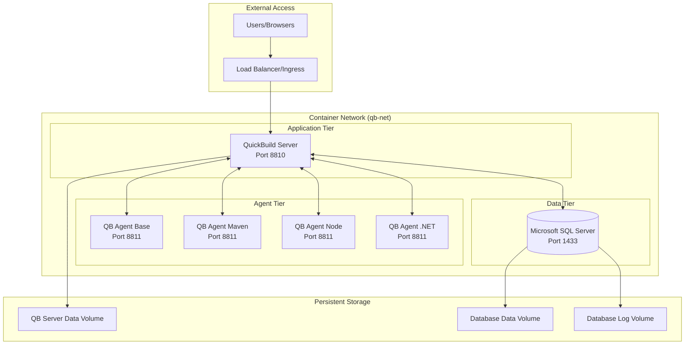
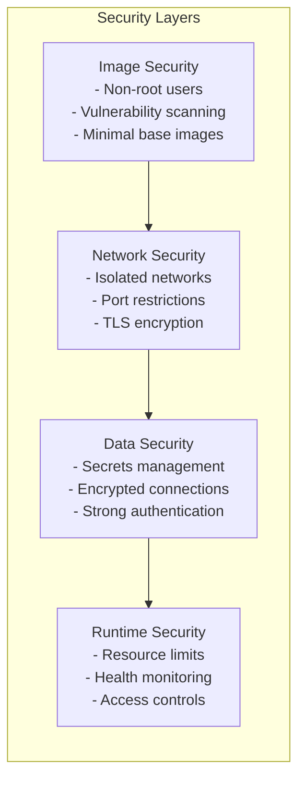

# Design Document

## Overview

The QuickBuild 14 containerization solution implements a multi-tier architecture using Docker containers with Microsoft SQL Server as the database backend. The design follows microservices principles with clear separation of concerns between database, application server, and build agents.

The architecture supports both development environments (Docker Compose) and production deployments (Kubernetes) while maintaining data persistence, security, and scalability requirements.

## Architecture

### High-Level Architecture



### Network Architecture

The design uses a dedicated Docker bridge network `qb-net` with subnet `172.20.0.0/16` to enable:
- DNS-based service discovery between containers
- Bi-directional communication between server and agents
- Network isolation from external networks
- Predictable IP addressing for troubleshooting

### Security Architecture



## Components and Interfaces

### Database Component (qb-database)

**Base Image:** `mcr.microsoft.com/mssql/server:2022-latest`

**Key Design Decisions:**
- Uses SQL Server Express edition for cost-effective deployment
- Implements custom initialization scripts for database setup
- Separates data and log volumes for performance optimization
- Includes health check using sqlcmd for reliable startup detection

**Configuration Interface:**
```yaml
Environment Variables:
  ACCEPT_EULA: Y (required for MSSQL)
  SA_PASSWORD: ${MSSQL_SA_PASSWORD} (from secrets)
  MSSQL_PID: Express
  MSSQL_COLLATION: SQL_Latin1_General_CP1_CI_AS

Volume Mounts:
  /var/opt/mssql/data: Database files
  /var/opt/mssql/log: Transaction logs
  /docker-entrypoint-initdb.d: Initialization scripts

Exposed Ports:
  1433: SQL Server (internal network only)
```

**Initialization Scripts:**
1. `01-create-database.sql`: Creates quickbuild database
2. `02-create-user.sql`: Creates qb_user with strong password
3. `03-grant-permissions.sql`: Grants db_owner role to qb_user

### QuickBuild Server Component (qb-server)

**Base Image:** `eclipse-temurin:8-jdk-focal`

**Key Design Decisions:**
- Uses consolidated data volume approach for simplified backup/restore
- Implements dynamic configuration via environment variables
- Creates symlinks to maintain expected QuickBuild directory structure
- Runs as non-root user for security compliance

**Configuration Interface:**
```yaml
Environment Variables:
  QB_DB_TYPE: mssql
  QB_DB_HOST: qb-database
  QB_DB_PORT: 1433
  QB_DB_NAME: quickbuild
  QB_DB_USER: qb_user
  QB_DB_PASSWORD: ${QB_DB_PASSWORD} (from secrets)
  QB_SERVER_URL: http://qb-server:8810

Volume Mounts:
  /opt/quickbuild/data: Consolidated data storage
  
Exposed Ports:
  8810: Web interface and API
```

**Entrypoint Logic:**
1. Check if first run (empty data volume)
2. If first run: move conf/, logs/, artifacts/ to data volume
3. Create symlinks from original locations to data volume
4. Generate hibernate.properties from template
5. Generate wrapper.conf from template
6. Start QuickBuild server process

### Build Agent Components (qb-agent-*)

**Base Image Strategy:**
- `qb-agent-base`: Core agent with JDK 8 and QB agent
- `qb-agent-maven`: Base + Maven 3.8.x
- `qb-agent-node`: Base + Node.js 16.x via NVM
- `qb-agent-dotnet`: Base + .NET SDK 6.0

**Key Design Decisions:**
- Uses layered approach for efficient image reuse
- Implements auto-discovery of container IP for node.properties
- Supports horizontal scaling through service replication
- Maintains persistent agent configuration

**Configuration Interface:**
```yaml
Environment Variables:
  QB_SERVER_URL: http://qb-server:8810
  AGENT_NAME: ${HOSTNAME} (auto-generated)
  AGENT_PORT: 8811

Volume Mounts:
  /opt/qb-agent/conf: Agent configuration

Exposed Ports:
  8811: Agent communication port
```

## Data Models

### Database Schema Design

The design leverages QuickBuild's existing schema with SQL Server-specific optimizations:

**Connection Configuration:**
```properties
hibernate.connection.driver_class=com.microsoft.sqlserver.jdbc.SQLServerDriver
hibernate.dialect=org.hibernate.dialect.SQLServer2012Dialect
hibernate.connection.url=jdbc:sqlserver://qb-database:1433;databaseName=quickbuild;encrypt=true;trustServerCertificate=true
hibernate.connection.username=qb_user
hibernate.connection.password=${QB_DB_PASSWORD}
```

**Connection Pool Settings:**
```properties
hibernate.c3p0.max_size=20
hibernate.c3p0.min_size=5
hibernate.c3p0.timeout=300
hibernate.c3p0.max_statements=50
hibernate.c3p0.idle_test_period=3000
```

### Volume Data Model

**QuickBuild Server Data Structure:**
```
/opt/quickbuild/data/
├── conf/
│   ├── hibernate.properties
│   ├── wrapper.conf
│   └── [other config files]
├── logs/
│   ├── console.log
│   └── [other log files]
└── artifacts/
    └── [build artifacts]
```

**Database Data Structure:**
```
/var/opt/mssql/
├── data/
│   ├── master.mdf
│   ├── quickbuild.mdf
│   └── [other database files]
└── log/
    ├── mastlog.ldf
    ├── quickbuild.ldf
    └── [other log files]
```

## Error Handling

### Container Startup Error Handling

**Database Container:**
1. **EULA Not Accepted:** Container fails with clear error message
2. **Weak Password:** Container fails with password requirement details
3. **Port Conflict:** Docker reports port binding error
4. **Volume Mount Issues:** Container logs permission errors

**Server Container:**
1. **Database Connection Failure:** Retry logic with exponential backoff
2. **Missing Configuration:** Generate from templates with defaults
3. **Port Binding Issues:** Log clear error and exit
4. **Volume Permission Issues:** Attempt to fix permissions in entrypoint

**Agent Container:**
1. **Server Unreachable:** Retry connection with configurable timeout
2. **Port Conflicts:** Auto-increment port and update configuration
3. **Registration Failure:** Log detailed error and retry

### Runtime Error Handling

**Health Check Failures:**
- Database: Retry sqlcmd connection test
- Server: Check HTTP endpoint with timeout
- Agent: Verify process running and server connection

**Resource Exhaustion:**
- Implement resource limits to prevent system impact
- Log warnings when approaching limits
- Graceful degradation when possible

### Backup and Recovery Error Handling

**Backup Failures:**
- Verify source data exists before backup
- Check destination space availability
- Validate backup integrity after creation
- Maintain backup rotation to prevent disk full

**Recovery Failures:**
- Validate backup file integrity before restore
- Check target system compatibility
- Provide rollback mechanism for failed restores

## Testing Strategy

### Unit Testing Approach

**Container Build Testing:**
```bash
# Test each Dockerfile builds successfully
docker build -t qb-database ./qb-database/
docker build -t qb-server ./qb-server/
docker build -t qb-agent-base ./qb-agent/base/
```

**Configuration Template Testing:**
```bash
# Test template generation with various inputs
./test-config-generation.sh
```

### Integration Testing Approach

**Service Connectivity Testing:**
```bash
# Test database connectivity
docker run --rm --network qb-net qb-server \
  sqlcmd -S qb-database -U qb_user -P ${QB_DB_PASSWORD} -Q "SELECT 1"

# Test server startup
curl -f http://localhost:8810/health || exit 1

# Test agent registration
docker logs qb-agent-1 | grep "Successfully registered"
```

**End-to-End Testing:**
```bash
# Deploy full stack
docker-compose up -d

# Wait for services to be ready
./scripts/wait-for-services.sh

# Run validation script
./scripts/validate-deployment.sh

# Test basic build functionality
./scripts/test-build-execution.sh
```

### Performance Testing Approach

**Load Testing:**
- Simulate multiple concurrent builds
- Monitor resource usage during peak load
- Test agent scaling under load
- Validate database connection pool behavior

**Stress Testing:**
- Test system behavior at resource limits
- Validate graceful degradation
- Test recovery after resource exhaustion

### Security Testing Approach

**Vulnerability Scanning:**
```bash
# Scan all custom images
trivy image qb-database:latest
trivy image qb-server:latest
trivy image qb-agent-base:latest
```

**Security Configuration Testing:**
- Verify non-root user execution
- Test network isolation
- Validate secrets handling
- Check file permissions

### Deployment Testing Strategy

**Docker Compose Testing:**
- Test fresh deployment
- Test upgrade scenarios
- Test backup/restore procedures
- Test scaling operations

**Kubernetes Testing:**
- Test StatefulSet deployment
- Test persistent volume claims
- Test service discovery
- Test ingress configuration

**Migration Testing:**
- Test migration from existing QB installation
- Validate data integrity after migration
- Test rollback procedures

### Automated Testing Pipeline

**CI/CD Integration:**
```yaml
stages:
  - build: Build all Docker images
  - test: Run unit and integration tests
  - security: Run vulnerability scans
  - deploy: Deploy to test environment
  - validate: Run validation scripts
  - cleanup: Clean up test resources
```

**Test Data Management:**
- Use test fixtures for consistent testing
- Implement test data cleanup procedures
- Maintain separate test and production data

This comprehensive design provides a solid foundation for implementing the QuickBuild 14 containerization solution with proper consideration for security, scalability, performance, and maintainability.